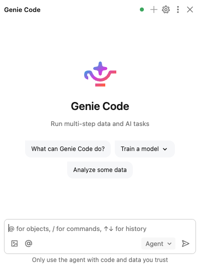
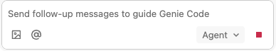
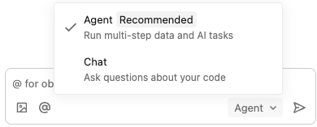
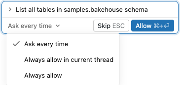

# 시작하기 — 모드, 단축키, 명령어

## Agent Mode vs Chat Mode

### Agent Mode 전환 방법 (UI 단계별 안내)

1. Databricks 워크스페이스에서 아무 **노트북**을 엽니다
2. 노트북 우측 상단에 **무지개색 별 아이콘**(✨)이 보입니다 — 이것이 Genie Code 버튼입니다
3. 아이콘을 클릭하면 화면 우측에 **Genie Code 사이드 패널**이 열립니다
4. 패널 하단의 드롭다운을 클릭하면 **Agent** / **Chat** 두 가지 모드가 나타납니다
5. **Agent**를 선택합니다

 → 

*우측 상단의 별 아이콘(✨)을 클릭하면 램프 모양으로 바뀌고, 클릭하면 사이드 패널이 열립니다*


*Agent 모드가 선택된 Genie Code 사이드 패널. 하단 입력창에 프롬프트를 입력합니다.*

> ⚠️ **주의**: Genie Code가 코드를 실행하면 하단에 **빨간색 Stop 버튼**이 표시됩니다. Stop 버튼이 보이는 동안은 AI가 아직 작업 중이므로, 다음 프롬프트를 입력하지 마세요.


*빨간색 ■ 버튼이 보이면 작업 진행 중. 완료되면 버튼이 사라집니다.*

| | **Agent Mode** (권장) | Chat Mode |
|---|---|---|
| 동작 방식 | 계획 → 코드 생성 → **실행** → 검증 → 에러 수정 | 코드 생성만 (실행 안 함) |
| MCP/Skills | 사용 가능 | 사용 불가 |
| 적합한 작업 | EDA, ETL, 대시보드, ML, 파이프라인 | 개념 설명, 간단한 코드 생성 |
| 승인 절차 | 실행 전 Plan 보여주고 승인 요청 | 없음 |


*Agent Mode를 선택하면 코드 생성 → 실행 → 검증까지 자동 수행합니다*

> 💡 **워크샵에서는 Agent Mode만 사용합니다.**

### 첫 번째 테스트 — Agent Mode 동작 확인

Agent Mode로 전환한 뒤, 아래 프롬프트를 붙여넣어 보세요:

```
현재 내 환경 정보를 알려줘:
1. 연결된 컴퓨트 종류 (Serverless/클러스터)
2. 접근 가능한 카탈로그 목록
3. Genie Code 모드 (Agent/Chat)
```

> Genie Code가 Plan(실행 계획)을 보여주고 "Allow" 버튼이 나타나면 Agent Mode가 정상입니다. **Plan을 읽은 후** "Allow in this thread"를 클릭하세요.

### 승인 옵션 (중요!)

Agent Mode가 코드를 실행하려 할 때 3가지 옵션이 나타납니다:

| 옵션 | 의미 | 권장 |
|------|------|------|
| **Allow** | 이번 한 번만 허용 | 안전하지만 매번 클릭 필요 |
| **Allow in this thread** | 이 대화에서는 항상 허용 | ✅ **워크샵에서 권장** |
| **Always allow** | 앞으로 영원히 허용 | ❌ **절대 사용 금지** (데이터 삭제 위험) |


*"Always allow in current thread"만 선택하세요. "Always allow"는 절대 금지!*

---

## 필수 단축키

| 동작 | macOS | Windows |
|------|-------|---------|
| **셀 안에서 인라인 호출** | `Cmd + I` | `Ctrl + I` |
| 자동완성 수동 트리거 | `Option + Shift + Space` | `Ctrl + Shift + Space` |
| 자동완성 수락 | `Tab` | `Tab` |
| 프롬프트 줄바꿈 | `Shift + Enter` | `Shift + Enter` |
| 프롬프트 전송 | `Enter` | `Enter` |

> 💡 **꿀팁**: 간단한 작업은 `Cmd+I` 인라인이 사이드 패널보다 훨씬 빠릅니다.

> 📸 **[스크린샷]**: `Cmd+I` 눌렀을 때 셀 안에 나타나는 인라인 프롬프트 입력창

---

## 슬래시 명령어

노트북 셀에서 `/`를 입력하면 사용 가능한 명령어가 나타납니다:

| 명령어 | 기능 | 사용 시점 |
|--------|------|----------|
| `/findTables` | Unity Catalog 테이블 검색 | **테이블 이름 모를 때** ⭐ |
| `/findQueries` | 기존 쿼리 검색 | 비슷한 분석 찾을 때 |
| `/explain` | 코드 설명 | 남의 코드 이해할 때 |
| `/fix` | 에러 수정 (diff 뷰) | 에러 발생 시 |
| `/optimize` | SQL/Python 최적화 | 쿼리 느릴 때 |
| `/doc` | 주석 추가 | 문서화할 때 |
| `/prettify` | 코드 포매팅 | 코드 정리 |

> 📸 **[스크린샷]**: `/` 입력 시 나타나는 명령어 목록 드롭다운
> 📸 **[스크린샷]**: `/findTables` 결과 — 관련 테이블 목록
> 📸 **[스크린샷]**: `/fix` 결과 — diff 뷰 (원본 vs 수정)
> 📸 **[스크린샷]**: `/optimize` 결과 — diff 뷰 (원본 vs 최적화)

### 슬래시 명령어 실습

각 명령어를 직접 실행해보세요:

**테이블 찾기** — 셀에 아래를 입력:
```
/findTables smart tv 시청
```

**코드 설명** — Python/SQL 코드가 있는 셀에서:
```
/explain
```
> 현재 셀의 코드를 한국어로 설명해줍니다.

**에러 수정** — 에러가 발생한 셀에서:
```
/fix
```
> 에러 원인을 분석하고, 수정된 코드를 diff 뷰로 보여줍니다. "Accept and run"을 클릭하면 바로 적용됩니다.

---

## 다음 단계

- **[프롬프트 5대 원칙](prompt-principles.md)** — 같은 Genie Code를 써도 프롬프트에 따라 결과가 3배 차이납니다.
