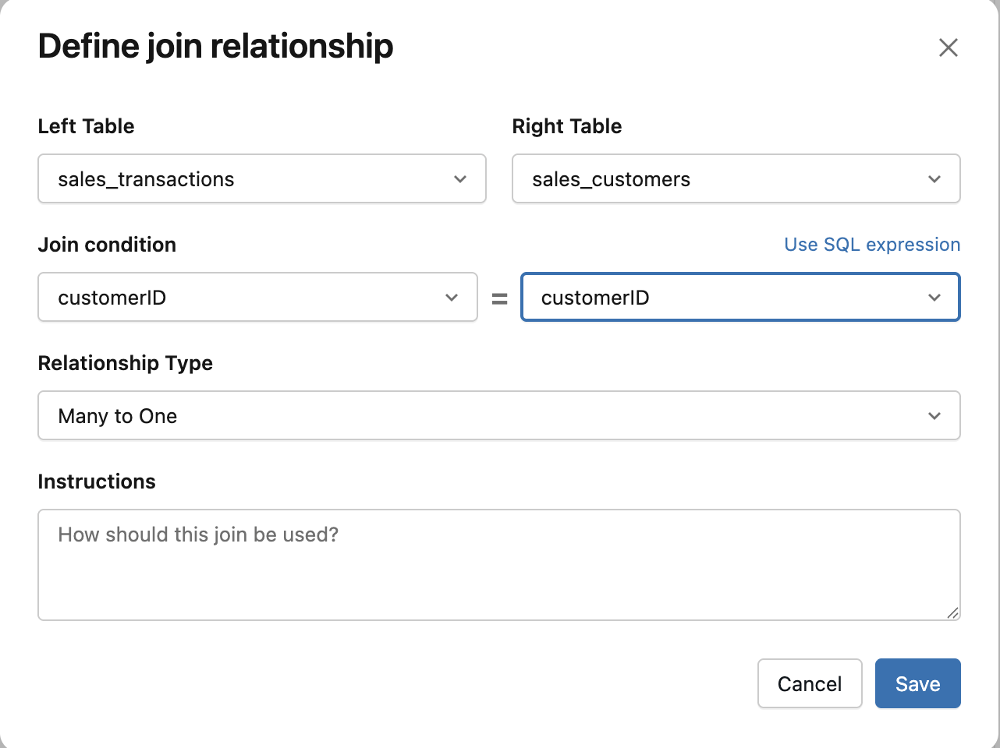
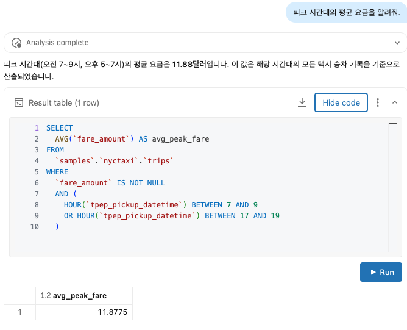
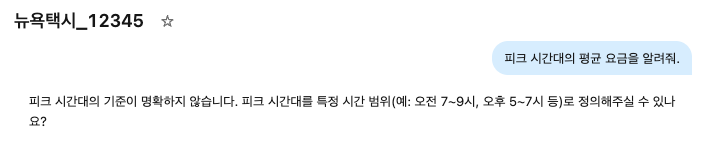
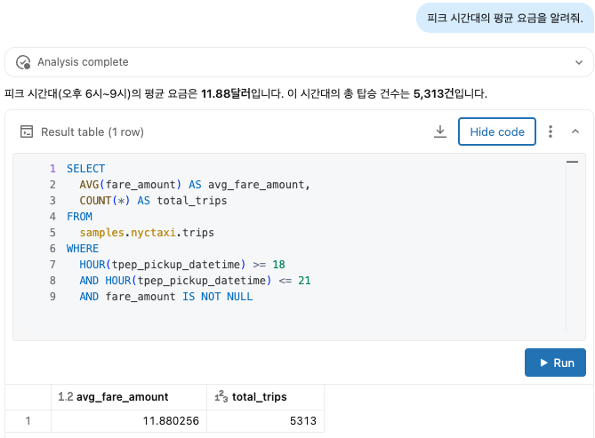

# 04. AI/BI 대시보드 & Genie Space — 분석과 자연어 탐색

> **소요 시간**: ~1.5시간 | **사전 조건**: [03. SDP 파이프라인](03-sdp-pipeline.md) 완료 (Gold 테이블 10개 필요)
>
> **실습 환경**: Genie Code + AI Dev Kit MCP 연결 상태에서 진행합니다 ([Section 3 참조](../section-3-ai-tools-setup/genie-code-aidevkit.md)). 대시보드 생성(`manage_dashboard`), Genie Space 생성(`manage_genie`), Job 스케줄링(`manage_jobs`) 모두 MCP 도구를 활용합니다. MCP 문제 발생 시 [트러블슈팅](../section-3-ai-tools-setup/genie-code-aidevkit.md#워크샵-실습-중-mcp-도구-문제)을 참조하세요.
>
> **핵심 메시지**: "대시보드는 '알려진 질문'에 답하고, Genie는 '아직 모르는 질문'에 답한다"

### 이 모듈에서 사용하는 Databricks 기능

| 기능 | 설명 | 공식 문서 |
|------|------|----------|
| **AI/BI Dashboard** | 코드 없이 SQL 기반 대시보드를 만드는 기능. KPI 카운터, 차트, 필터를 조합하여 비즈니스 대시보드를 구성합니다. Genie Code로 자연어 한 줄로 생성할 수 있습니다. | [docs](https://docs.databricks.com/en/dashboards/index.html) |
| **Genie Space** | 비개발자가 **자연어로 질문**하면 AI가 자동으로 SQL을 생성하여 데이터를 분석하는 공간입니다. 테이블을 등록하고, 비즈니스 용어와 규칙을 가르치면 정확도가 올라갑니다. | [docs](https://docs.databricks.com/en/genie/index.html) |
| **AI Dev Kit MCP** | Genie Space를 Genie Code에서 **자연어로 생성/관리**하려면 AI Dev Kit MCP 연결이 필요합니다. Section 3에서 구성한 `manage_genie`, `manage_dashboard` 도구를 사용합니다. | [GitHub](https://github.com/databricks-solutions/ai-dev-kit) |

## 개요

Gold 테이블을 기반으로:
1. **AI/BI 대시보드**: 경영진과 운영팀이 일상적으로 확인하는 KPI 대시보드
2. **Genie Space**: 비개발자가 자연어로 데이터를 탐색하는 공간
3. **Genie 정확도 고도화**: 샘플 질문, 조인 관계, 쿼리 힌트 등으로 Genie의 SQL 생성 정확도를 끌어올리는 방법

---

## Part A: AI/BI 대시보드

### 대시보드 1: Smart TV Operations Dashboard

> 디바이스 운영팀이 매일 확인하는 운영 현황 대시보드

#### Genie Code 프롬프트

```
gold.daily_viewing_summary, gold.device_health_score, gold.streaming_qoe, gold.error_rate_by_firmware 테이블을 활용하여 "Smart TV Operations Dashboard"를 만들어줘.

포함할 위젯 (총 12개):

Row 1 — KPI 카운터 (4개):
1. 총 활성 디바이스 수 (오늘 viewing 기록이 있는 unique device)
2. 평균 일 시청 시간 (분)
3. 평균 디바이스 건강 점수 (0~100)
4. 스트리밍 QoE 평균 점수

Row 2 — 시계열 차트 (2개):
5. 일별 활성 디바이스 추이 (최근 30일, 꺾은선)
6. 일별 평균 시청 시간 추이 (최근 30일, 꺾은선, content_source별 색상 구분)

Row 3 — 분포 차트 (3개):
7. 제품라인별 활성 디바이스 비율 (도넛 차트: OLED_C, OLED_G, QNED 등)
8. 지역별 평균 시청 시간 (가로 막대: KR, US, EU, JP, SEA, LATAM)
9. 건강 등급 분포 (Stacked Bar: A/B/C/D/F)

Row 4 — 운영 지표 (3개):
10. 펌웨어 버전별 에러율 히트맵 (X축: 날짜, Y축: 버전, 색상: 에러율)
11. 앱별 스트리밍 QoE 비교 (막대 차트: Netflix, YouTube, Wavve 등)
12. 시간대별 동시 접속자 히트맵 (X축: 시간, Y축: 요일, 색상: 접속자 수)

필터:
- 날짜 범위 (기본: 최근 30일)
- 지역 (region)
- 제품라인 (product_line)

AI/BI 대시보드로 생성해줘.
```

### 대시보드 생성 확인

```
방금 만든 "Smart TV Operations Dashboard"가 잘 생성됐는지 확인해줘.
대시보드 URL과 포함된 위젯 목록을 보여줘.
```

### 대시보드 2: Ad Performance Dashboard

> 광고 사업팀이 확인하는 광고 성과 대시보드

#### Genie Code 프롬프트

```
gold.ad_campaign_kpi 테이블을 활용하여 "Ad Performance Dashboard"를 만들어줘.

위젯 (총 10개):

Row 1 — KPI 카운터 (4개):
1. 총 노출 수 (impressions 합계)
2. 평균 CTR (%)
3. 평균 VCR (완료율 %)
4. 총 수익 (total_revenue_usd 합계, $표시)

Row 2 — 추이 (2개):
5. 일별 노출/클릭/완료 추이 (Multi-line)
6. 일별 eCPM 추이 (꺾은선)

Row 3 — 분석 (4개):
7. 광고 형식별 CTR 비교 (막대: banner, preroll, native, screensaver, pause_ad)
8. 노출 위치별 VCR 비교 (막대: home_screen, lg_channels, content_store, epg)
9. 상위 10 광고주 수익 랭킹 (가로 막대)
10. 시간대별 eCPM 히트맵 (프라임타임 효과 시각화)

필터:
- 날짜 범위
- 광고 형식 (ad_format)
- 노출 위치 (placement)
- 광고주 (advertiser_name)

AI/BI 대시보드로 생성해줘.
```

### 대시보드 3: Content & Engagement Dashboard

> 콘텐츠 전략팀이 확인하는 콘텐츠/시청 분석 대시보드

#### Genie Code 프롬프트

```
gold.content_popularity, gold.daily_viewing_summary, gold.hourly_engagement, gold.user_engagement_360을 활용하여 "Content & Engagement Dashboard"를 만들어줘.

위젯 (총 10개):

Row 1 — KPI (3개):
1. 일 평균 시청 시간 (전체)
2. OTT vs Live TV 비율 (게이지)
3. 4K + HDR 시청 비율 (게이지)

Row 2 — 콘텐츠 인기도 (3개):
4. 장르별 시청 시간 비중 (트리맵: Drama, Entertainment, News, Sports 등)
5. 인기 프로그램 Top 15 (가로 막대, viewers 기준)
6. 앱별 시청 시간 비중 (도넛: Netflix, YouTube, Live TV 등)

Row 3 — 사용자 행동 (4개):
7. 시간대별 활성 사용자 히트맵 (24시간 × 7요일)
8. 사용자 세그먼트 분포 (파이: power_user, ott_native, linear_loyalist, gamer, casual)
9. 주말 vs 평일 시청 패턴 비교 (Grouped Bar)
10. 지역별 Top 장르 비교 (Heatmap: region × genre)

필터: 날짜 범위, 지역, 제품라인, content_source

AI/BI 대시보드로 생성해줘.
```

---

## Part B: Genie Space 생성

### Genie Space란?

비개발자가 **자연어로 질문**하면 Genie가 자동으로 SQL을 생성하여 답변하는 공간입니다. 대시보드가 "미리 정의된 질문"에 답한다면, Genie Space는 **"아직 정의되지 않은 질문"**에 답합니다.

> 💡 **대시보드 vs Genie Space**: 대시보드는 "이번 달 시청자가 몇 명?"처럼 **미리 정의한 질문**에 답합니다. Genie Space는 "65인치 OLED에서 넷플릭스 시청 시간이 드라마 장르에서 얼마나 되지?"처럼 **즉석에서 떠오르는 질문**에 자연어로 답합니다.

### Genie Space 1: TV 시청 분석

#### Genie Code 프롬프트 (AI Dev Kit MCP 필요)

```
다음 설정으로 Genie Space를 만들어줘.

이름: LG Smart TV 시청 분석
설명: Smart TV 시청 데이터를 자연어로 탐색합니다. 시청 시간, 콘텐츠 인기도, 사용자 행동 패턴을 분석할 수 있습니다.

포함 테이블:
- lge_smart_tv.gold.daily_viewing_summary
- lge_smart_tv.gold.content_popularity
- lge_smart_tv.gold.hourly_engagement
- lge_smart_tv.gold.user_engagement_360
- lge_smart_tv.silver.viewing_sessions (상세 분석용)
- lge_smart_tv.bronze.devices (디바이스 마스터)

General Instructions:
- 시청 시간은 분(min) 단위로 표시하되, 1시간 이상이면 시간:분 형식도 병기
- 날짜 필터가 없으면 최근 7일 기준
- 지역 비교 시 한국어 지역명 사용 (KR→한국, US→미국, EU→유럽, JP→일본)
- 비율은 소수점 1자리까지 표시
- 결과가 10행 이상이면 자동으로 Top 10으로 제한하고, "전체 N건 중 Top 10" 표시
```

### Genie Space 생성 확인 & 첫 테스트

```
방금 만든 "LG Smart TV 시청 분석" Genie Space에 테스트 질문을 해줘:
"최근 7일간 가장 인기 있는 앱 Top 5는?"
SQL이 정상 생성되고 결과가 나오는지 확인해줘.
```

### Genie Space 2: 광고 성과 분석

#### Genie Code 프롬프트

```
다음 설정으로 Genie Space를 만들어줘.

이름: LG Ad Performance
설명: LG Smart TV 광고 캠페인의 노출, 클릭, 전환 성과를 자연어로 분석합니다.

포함 테이블:
- lge_smart_tv.gold.ad_campaign_kpi
- lge_smart_tv.silver.ad_funnel (상세 퍼널)
- lge_smart_tv.silver.acr_content (ACR 콘텐츠 매칭)
- lge_smart_tv.bronze.devices

General Instructions:
- 금액은 USD 기준, 천 단위 콤마 표시
- CTR, VCR 등 비율은 % 단위로 표시
- 광고주명은 정확히 매칭, 부분 매칭 시 LIKE 사용
- "프라임타임"은 20~23시 (KST 기준)
- "실적이 좋은"은 CTR > 평균 CTR AND VCR > 평균 VCR 의미
```

### Genie Space 3: 디바이스 운영/건강

#### Genie Code 프롬프트

```
다음 설정으로 Genie Space를 만들어줘.

이름: TV 디바이스 운영 분석
설명: Smart TV 디바이스의 건강 상태, 에러율, 펌웨어 현황을 분석합니다.

포함 테이블:
- lge_smart_tv.gold.device_health_score
- lge_smart_tv.gold.streaming_qoe
- lge_smart_tv.gold.error_rate_by_firmware
- lge_smart_tv.silver.error_events
- lge_smart_tv.silver.system_metrics
- lge_smart_tv.bronze.devices

General Instructions:
- 건강 점수는 0~100 스케일, 등급은 A/B/C/D/F
- "문제 있는 디바이스"는 health_grade가 D 또는 F
- "안정적인 펌웨어"는 에러율 < 1%
- 온도는 섭씨(°C) 표시
- 에러율은 (에러 건수 / 활성 디바이스 수) * 100 으로 계산
```

---

## Part C: Genie 정확도 고도화 ⭐

> **이 섹션이 가장 중요합니다.** Genie Space를 만드는 것은 쉽지만, 정확한 답변을 내놓게 만드는 것은 튜닝이 필요합니다.

### Genie 정확도를 결정하는 5가지 요소

| # | 요소 | 영향도 | 설명 |
|---|------|-------|------|
| 1 | **테이블/컬럼 코멘트** | ★★★★★ | Genie가 테이블/컬럼의 의미를 이해하는 핵심 |
| 2 | **샘플 질문 (Curated Q&A)** | ★★★★★ | 검증된 SQL 패턴을 Genie에게 가르침 |
| 3 | **General Instructions** | ★★★★☆ | 비즈니스 규칙, 용어 정의, 계산 공식 |
| 4 | **테이블 간 관계 (Joins)** | ★★★★☆ | 올바른 조인 경로를 안내 |
| 5 | **인증된 쿼리** | ★★★☆☆ | 자주 쓰는 패턴을 사전 검증 |

### Step 1: 테이블/컬럼 코멘트 추가

#### Genie Code 프롬프트

```
lge_smart_tv.gold 스키마의 모든 테이블과 컬럼에 한국어 COMMENT를 추가해줘.

규칙:
- 테이블 COMMENT: 비즈니스 담당자가 이해할 수 있는 설명 (50자 이내)
- 컬럼 COMMENT: 값의 의미, 단위, 범위를 포함

예시:
ALTER TABLE lge_smart_tv.gold.daily_viewing_summary SET TBLPROPERTIES (
  'comment' = '디바이스별 일별 시청 통계 집계 테이블'
);

COMMENT ON COLUMN lge_smart_tv.gold.daily_viewing_summary.total_viewing_min IS 
  '일 총 시청 시간(분). Live TV + OTT + HDMI 합산. 범위: 0~1440';

COMMENT ON COLUMN lge_smart_tv.gold.daily_viewing_summary.primetime_min IS 
  '프라임타임(20~23시 KST) 시청 시간(분)';

COMMENT ON COLUMN lge_smart_tv.gold.daily_viewing_summary.hdr_viewing_pct IS 
  'HDR 콘텐츠 시청 비율(%). DolbyVision + HDR10 + HDR10Plus + HLG';

모든 Gold 테이블(daily_viewing_summary, content_popularity, ad_campaign_kpi, device_health_score, streaming_qoe, hourly_engagement, voice_usage_analytics, iot_ecosystem_stats, error_rate_by_firmware, user_engagement_360)의 모든 컬럼에 COMMENT를 달아줘.
```

### Step 2: 샘플 질문 (Curated Questions) 등록 ⭐⭐⭐

> **Genie 정확도를 가장 크게 올리는 방법**입니다. 검증된 SQL을 샘플로 등록하면, 비슷한 질문이 들어올 때 해당 패턴을 참고합니다.

> **샘플 질문 등록 방법**: 
> - **방법 1 (AI Dev Kit MCP)**: 아래 프롬프트로 Genie Code에서 등록
> - **방법 2 (UI)**: Genie Space 화면 → 우측 상단 ⚙️ Settings → "Example questions" → "+ Add" 버튼
>
> MCP로 일괄 등록하는 프롬프트:
> ```
> "LG Smart TV 시청 분석" Genie Space에 아래 샘플 질문 15개를 모두 등록해줘.
> 각 질문에 검증된 SQL도 함께 등록해줘.
> ```

#### 시청 분석 Genie Space — 샘플 질문 15개

Genie Space 설정 화면에서 아래 질문과 SQL 쌍을 등록합니다:

**질문 1**: 최근 7일간 가장 많이 시청된 프로그램 Top 10은?
```sql
SELECT 
  program_title,
  genre,
  content_source,
  SUM(total_viewers) AS total_viewers,
  ROUND(SUM(total_viewing_min), 1) AS total_viewing_min,
  ROUND(AVG(avg_viewing_min), 1) AS avg_viewing_min_per_viewer
FROM lge_smart_tv.gold.content_popularity
WHERE event_date >= CURRENT_DATE - INTERVAL 7 DAYS
  AND program_title != 'Unknown'
GROUP BY program_title, genre, content_source
ORDER BY total_viewers DESC
LIMIT 10
```

**질문 2**: 한국 지역에서 OTT vs Live TV 시청 비율은?
```sql
SELECT
  ROUND(SUM(ott_min) / (SUM(ott_min) + SUM(live_tv_min)) * 100, 1) AS ott_pct,
  ROUND(SUM(live_tv_min) / (SUM(ott_min) + SUM(live_tv_min)) * 100, 1) AS live_tv_pct,
  ROUND(SUM(ott_min), 0) AS total_ott_min,
  ROUND(SUM(live_tv_min), 0) AS total_live_tv_min
FROM lge_smart_tv.gold.daily_viewing_summary
WHERE region = 'KR'
  AND event_date >= CURRENT_DATE - INTERVAL 7 DAYS
```

**질문 3**: OLED vs QNED 모델별 평균 시청 시간 비교
```sql
SELECT
  d.product_line,
  COUNT(DISTINCT v.device_id) AS active_devices,
  ROUND(AVG(v.total_viewing_min), 1) AS avg_daily_viewing_min,
  ROUND(AVG(v.session_count), 1) AS avg_sessions,
  ROUND(AVG(v.hdr_viewing_pct), 1) AS avg_hdr_pct
FROM lge_smart_tv.gold.daily_viewing_summary v
JOIN lge_smart_tv.bronze.devices d ON v.device_id = d.device_id
WHERE v.event_date >= CURRENT_DATE - INTERVAL 7 DAYS
GROUP BY d.product_line
ORDER BY avg_daily_viewing_min DESC
```

**질문 4**: 프라임타임(20~23시) 시청자가 가장 많은 요일은?
```sql
SELECT
  CASE DAYOFWEEK(event_date)
    WHEN 1 THEN '일' WHEN 2 THEN '월' WHEN 3 THEN '화' WHEN 4 THEN '수'
    WHEN 5 THEN '목' WHEN 6 THEN '금' WHEN 7 THEN '토'
  END AS day_of_week,
  DAYOFWEEK(event_date) AS day_num,
  COUNT(DISTINCT device_id) AS primetime_viewers,
  ROUND(AVG(primetime_min), 1) AS avg_primetime_min
FROM lge_smart_tv.gold.daily_viewing_summary
WHERE event_date >= CURRENT_DATE - INTERVAL 30 DAYS
  AND primetime_min > 0
GROUP BY DAYOFWEEK(event_date)
ORDER BY day_num
```

**질문 5**: Netflix 사용자의 평균 시청 시간과 선호 장르는?
```sql
SELECT
  v.top_genre,
  COUNT(DISTINCT v.device_id) AS netflix_users,
  ROUND(AVG(v.total_viewing_min), 1) AS avg_viewing_min,
  ROUND(AVG(v.hdr_viewing_pct), 1) AS avg_hdr_pct,
  ROUND(AVG(v.`4k_viewing_pct`), 1) AS avg_4k_pct
FROM lge_smart_tv.gold.daily_viewing_summary v
WHERE v.top_app = 'netflix'
  AND v.event_date >= CURRENT_DATE - INTERVAL 7 DAYS
GROUP BY v.top_genre
ORDER BY netflix_users DESC
```

**질문 6**: 65인치 OLED TV의 평균 일 시청 시간은?
```sql
SELECT
  d.model_name,
  d.product_line,
  COUNT(DISTINCT v.device_id) AS device_count,
  ROUND(AVG(v.total_viewing_min), 1) AS avg_daily_min,
  ROUND(AVG(v.session_count), 1) AS avg_sessions
FROM lge_smart_tv.gold.daily_viewing_summary v
JOIN lge_smart_tv.bronze.devices d ON v.device_id = d.device_id
WHERE d.screen_size_inch = 65
  AND d.product_line LIKE 'OLED%'
  AND v.event_date >= CURRENT_DATE - INTERVAL 7 DAYS
GROUP BY d.model_name, d.product_line
ORDER BY avg_daily_min DESC
```

**질문 7**: 최근 한 달간 시청 시간이 증가 추세인지, 감소 추세인지?
```sql
WITH weekly AS (
  SELECT
    DATE_TRUNC('week', event_date) AS week_start,
    ROUND(AVG(total_viewing_min), 1) AS avg_viewing_min,
    COUNT(DISTINCT device_id) AS active_devices
  FROM lge_smart_tv.gold.daily_viewing_summary
  WHERE event_date >= CURRENT_DATE - INTERVAL 30 DAYS
  GROUP BY DATE_TRUNC('week', event_date)
)
SELECT
  week_start,
  avg_viewing_min,
  active_devices,
  ROUND(avg_viewing_min - LAG(avg_viewing_min) OVER (ORDER BY week_start), 1) AS wow_change_min,
  ROUND((avg_viewing_min - LAG(avg_viewing_min) OVER (ORDER BY week_start)) / 
    LAG(avg_viewing_min) OVER (ORDER BY week_start) * 100, 1) AS wow_change_pct
FROM weekly
ORDER BY week_start
```

**질문 8**: Power User (하루 4시간 이상 시청)는 전체의 몇 퍼센트?
```sql
SELECT
  COUNT(DISTINCT CASE WHEN avg_daily_viewing_min >= 240 THEN device_id END) AS power_users,
  COUNT(DISTINCT device_id) AS total_users,
  ROUND(COUNT(DISTINCT CASE WHEN avg_daily_viewing_min >= 240 THEN device_id END) * 100.0 / 
    COUNT(DISTINCT device_id), 1) AS power_user_pct
FROM lge_smart_tv.gold.user_engagement_360
```

**질문 9**: 어떤 장르가 주말에 더 많이 시청되나?
```sql
SELECT
  genre,
  ROUND(SUM(CASE WHEN DAYOFWEEK(event_date) IN (1, 7) THEN total_viewing_min ELSE 0 END), 0) AS weekend_min,
  ROUND(SUM(CASE WHEN DAYOFWEEK(event_date) NOT IN (1, 7) THEN total_viewing_min ELSE 0 END), 0) AS weekday_min,
  ROUND(SUM(CASE WHEN DAYOFWEEK(event_date) IN (1, 7) THEN total_viewing_min ELSE 0 END) /
    NULLIF(SUM(CASE WHEN DAYOFWEEK(event_date) NOT IN (1, 7) THEN total_viewing_min ELSE 0 END), 0), 2) AS weekend_to_weekday_ratio
FROM lge_smart_tv.gold.content_popularity
WHERE event_date >= CURRENT_DATE - INTERVAL 30 DAYS
GROUP BY genre
ORDER BY weekend_to_weekday_ratio DESC
```

**질문 10**: 지역별 Top 3 인기 앱은?
```sql
WITH ranked AS (
  SELECT
    region,
    top_app,
    COUNT(*) AS usage_count,
    ROW_NUMBER() OVER (PARTITION BY region ORDER BY COUNT(*) DESC) AS rn
  FROM lge_smart_tv.gold.daily_viewing_summary
  WHERE event_date >= CURRENT_DATE - INTERVAL 7 DAYS
    AND top_app IS NOT NULL
  GROUP BY region, top_app
)
SELECT region, top_app, usage_count
FROM ranked
WHERE rn <= 3
ORDER BY region, rn
```

#### 광고 Genie Space — 샘플 질문 5개

**질문 11**: 이번 달 CTR이 가장 높은 광고 형식은?
```sql
SELECT
  ad_format,
  SUM(impressions) AS total_impressions,
  SUM(clicks) AS total_clicks,
  ROUND(SUM(clicks) * 100.0 / NULLIF(SUM(impressions), 0), 2) AS ctr_pct,
  ROUND(SUM(total_revenue_usd), 2) AS total_revenue
FROM lge_smart_tv.gold.ad_campaign_kpi
WHERE event_date >= DATE_TRUNC('month', CURRENT_DATE)
GROUP BY ad_format
ORDER BY ctr_pct DESC
```

**질문 12**: 프라임타임 vs 비프라임타임 광고 eCPM 차이는?

> **참고**: `ad_campaign_kpi`에는 시간대(hour) 컬럼이 없어 `hourly_engagement`와 `event_date` 기준으로 조인합니다. 이 방식은 근사값이며, 정확한 시간대별 분석이 필요하면 `silver.ad_funnel` 테이블의 timestamp를 직접 사용하세요.

```sql
-- hourly_engagement 테이블과 조인하여 시간대별 광고 성과 비교 (근사값)
-- 정확한 분석이 필요하면 silver.ad_funnel의 timestamp 사용 권장
SELECT
  CASE WHEN h.hour_of_day BETWEEN 20 AND 23 THEN '프라임타임 (20~23시)' ELSE '비프라임타임' END AS time_slot,
  ROUND(AVG(a.ecpm), 2) AS avg_ecpm,
  SUM(a.impressions) AS total_impressions,
  ROUND(SUM(a.total_revenue_usd), 2) AS total_revenue
FROM lge_smart_tv.gold.ad_campaign_kpi a
JOIN lge_smart_tv.gold.hourly_engagement h 
  ON a.event_date = h.event_date
WHERE a.event_date >= CURRENT_DATE - INTERVAL 7 DAYS
GROUP BY CASE WHEN h.hour_of_day BETWEEN 20 AND 23 THEN '프라임타임 (20~23시)' ELSE '비프라임타임' END
```

**질문 13**: 상위 5개 광고주의 캠페인 성과 비교
```sql
WITH top_advertisers AS (
  SELECT advertiser_name, SUM(total_revenue_usd) AS total_rev
  FROM lge_smart_tv.gold.ad_campaign_kpi
  WHERE event_date >= CURRENT_DATE - INTERVAL 30 DAYS
  GROUP BY advertiser_name
  ORDER BY total_rev DESC
  LIMIT 5
)
SELECT
  a.advertiser_name,
  SUM(a.impressions) AS impressions,
  ROUND(SUM(a.clicks) * 100.0 / NULLIF(SUM(a.impressions), 0), 2) AS ctr,
  ROUND(SUM(a.completions) * 100.0 / NULLIF(SUM(a.impressions), 0), 2) AS vcr,
  ROUND(SUM(a.total_revenue_usd), 2) AS revenue,
  ROUND(AVG(a.ecpm), 2) AS avg_ecpm
FROM lge_smart_tv.gold.ad_campaign_kpi a
JOIN top_advertisers t ON a.advertiser_name = t.advertiser_name
WHERE a.event_date >= CURRENT_DATE - INTERVAL 30 DAYS
GROUP BY a.advertiser_name
ORDER BY revenue DESC
```

**질문 14**: home_screen 배너 광고의 월별 수익 추이는?
```sql
SELECT
  DATE_TRUNC('month', event_date) AS month,
  SUM(impressions) AS impressions,
  ROUND(SUM(total_revenue_usd), 2) AS revenue,
  ROUND(AVG(ecpm), 2) AS avg_ecpm,
  ROUND(SUM(clicks) * 100.0 / NULLIF(SUM(impressions), 0), 2) AS ctr
FROM lge_smart_tv.gold.ad_campaign_kpi
WHERE placement = 'home_screen'
  AND ad_format = 'display_banner'
GROUP BY DATE_TRUNC('month', event_date)
ORDER BY month
```

**질문 15**: screensaver 광고의 완료율이 다른 형식보다 높은가?
```sql
SELECT
  ad_format,
  SUM(impressions) AS impressions,
  ROUND(AVG(avg_completion_pct), 1) AS avg_completion_pct,
  ROUND(SUM(completions) * 100.0 / NULLIF(SUM(impressions), 0), 1) AS vcr,
  ROUND(AVG(ecpm), 2) AS avg_ecpm
FROM lge_smart_tv.gold.ad_campaign_kpi
WHERE event_date >= CURRENT_DATE - INTERVAL 30 DAYS
GROUP BY ad_format
ORDER BY vcr DESC
```

### Genie Space 설정 UI 상세 가이드

Genie Space를 생성한 뒤, 정확도를 높이려면 **Settings** 화면에서 여러 항목을 구성해야 합니다. 아래는 단계별 UI 경로입니다.

#### 설정 화면 접근 방법

1. Databricks 왼쪽 사이드바 → **SQL** → **Genie**
2. 생성한 Genie Space 클릭 (예: "LG Smart TV 시청 분석")
3. 화면 우측 상단 ⚙️ **Configure** 클릭
4. 아래 6개 탭이 나타납니다:

| 탭 | 용도 | 설정 내용 |
|---|------|----------|
| **About** | 기본 정보 | 이름, 설명, SQL Warehouse 연결 확인 |
| **Data** | 연결된 테이블 | 테이블 추가/제거, 테이블별 설명(Description), 동의어(Synonyms) |
| **Instructions** | 비즈니스 규칙 | 용어 정의, 계산 규칙, 출력 형식 (아래 Step 3에서 상세 설명) |
| **Joins** | 테이블 관계 | 테이블 간 조인 키와 관계 유형 (1:N, N:1) 정의 |
| **SQL Expressions** | 사전 정의 수식 | Filter, Measure, Dimension 등록 |
| **SQL Queries** | 샘플 질문 | Example Query (검증된 SQL), SQL Function 등록 |

> 📸 **[스크린샷]**: Genie Space Configure 화면 — 6개 탭 (About, Data, Instructions, Joins, SQL Expressions, SQL Queries)

#### Joins 탭 설정

**+ Add** 버튼을 클릭하여 테이블 간 관계를 정의합니다:

| Left Table | Right Table | Join Key | 관계 |
|-----------|------------|----------|------|
| daily_viewing_summary | devices | device_id | Many to One |
| content_popularity | daily_viewing_summary | event_date | Many to Many |
| user_engagement_360 | devices | device_id | One to One |

> 💡 **왜 Joins를 설정하나?** Genie가 "65인치 OLED의 시청 시간"을 물어보면, `daily_viewing_summary`와 `devices`를 어떤 키로 조인해야 하는지 알아야 합니다. Joins를 설정하지 않으면 Genie가 잘못된 조인을 하거나 조인 자체를 못 합니다.

#### SQL Expressions 탭 — 재사용 가능한 비즈니스 로직 등록

| 유형 | 이름 | SQL | 설명 |
|------|------|-----|------|
| **Filter** | 프라임타임 시청 | `is_primetime = true` | 프라임타임(20~23시) 필터 |
| **Measure** | 평균 시청 시간 | `ROUND(AVG(total_viewing_min), 1)` | 소수점 1자리 평균 |
| **Dimension** | 분기 구분 | `CASE WHEN MONTH(event_date) BETWEEN 1 AND 3 THEN 'Q1' ... END` | 날짜를 분기로 변환 |


*Left Table, Right Table, Join Key, Relationship Type을 지정하여 테이블 관계를 정의합니다*

> 📸 **[스크린샷]**: SQL Expressions → Filter/Measure/Dimension 추가 화면

#### SQL Queries 탭 — 샘플 질문 등록

**+ Add** → **Example query** 클릭:

1. **Question**: 질문을 입력 (예: "최근 7일간 인기 프로그램 Top 10")
2. **SQL answer**: 검증된 SQL을 붙여넣기 (아래 Step 2의 15개 SQL 참조)
3. **Save**

> 📸 **[스크린샷]**: Example query 등록 화면 — Question + SQL answer 입력

#### Benchmarks — 정확도 측정 (선택)

질문과 정답 SQL을 등록하면, Genie가 생성한 SQL이 정답과 얼마나 일치하는지 자동 평가합니다.

**+ Add benchmark** 클릭 → Question과 Ground truth SQL answer 입력 → **Run all benchmarks**

> 💡 이 기능을 활용하면 "Genie 정확도 80% → 95%"와 같은 정량적 개선을 추적할 수 있습니다.

### Step 3: General Instructions 상세 설정

> ⚠️ **중요**: General Instructions를 변경한 후에는 반드시 **New Chat** 버튼을 클릭하여 새 대화를 시작하세요. 기존 대화에는 이전 지침의 컨텍스트가 남아 있어, 변경된 지침이 즉시 반영되지 않을 수 있습니다.

#### 시청 분석 Genie Space

Genie Space 설정 → General Instructions에 아래 내용을 추가합니다:

```
## 비즈니스 용어 정의
- "프라임타임": 20:00~23:00 KST
- "활성 디바이스": 해당 날짜에 viewing_logs 또는 app_launch_events가 1건 이상 있는 디바이스
- "Power User": 일 평균 시청 시간 240분(4시간) 이상
- "OTT 네이티브": OTT 시청 비율이 70% 이상인 사용자
- "Linear Loyalist": Live TV 시청 비율이 60% 이상인 사용자
- "시청 시간": duration_min 컬럼 사용 (분 단위). 1시간 이상이면 "X시간 Y분"으로도 표시

## 계산 규칙
- 비율 계산 시 분모가 0이면 NULLIF 사용
- 날짜 필터 미지정 시 기본 최근 7일
- "최근"은 CURRENT_DATE 기준
- 지역 코드 → 한국어 매핑: KR=한국, US=미국, EU=유럽, JP=일본, SEA=동남아, LATAM=중남미
- product_line 한국어 매핑: OLED_C=OLED C시리즈, OLED_G=OLED G시리즈, QNED=QNED, NANO=NanoCell, UHD=UHD

## 테이블 관계 (조인 키)
- daily_viewing_summary ↔ devices: device_id
- content_popularity ↔ viewing_sessions: program_title + event_date
- hourly_engagement ↔ daily_viewing_summary: event_date
- user_engagement_360 ↔ devices: device_id
- 디바이스 속성 (region, product_line, screen_size) 질문 시 반드시 devices 테이블 조인

## 출력 규칙
- 결과 10행 초과 시 Top 10 + "전체 N건" 표시
- 금액은 소수점 2자리, 비율은 소수점 1자리
- 시간 관련은 분(min) 기본, 필요시 시:분 병기
```

**Before — 임의 정의 문제 (Instructions 미설정 시)**:


*Genie가 "피크 시간대"를 임의로 정의하여 분석 — 사용자 의도와 다를 수 있음*

**After — Instructions 설정 후 사용자에게 질문**:


*"피크 시간대의 기준이 명확하지 않습니다. 정의해주실 수 있나요?" — 올바른 동작!*

**기준 제공 후 정확한 SQL 생성**:


*사용자가 정의한 피크 시간대(18~21시)를 정확히 반영한 SQL 생성*

> 💡 **임의 정의 방지 규칙**: General Instructions에 아래 내용을 반드시 추가하세요. 이를 넣지 않으면 Genie가 "프라임타임", "활성 사용자" 등의 기준을 임의로 정의해서 분석할 수 있습니다.
> ```
> ## 분석 규칙
> - 구체적인 기준이 명확하지 않은 경우, 임의로 정의해서 분석하지 말 것
> - 답을 도출하기 위해 더 정확한 정보가 필요할 때는 사용자에게 반드시 질문할 것
> ```

### Step 4: Genie 성능 테스트 & 반복 튜닝

#### Genie Code 프롬프트: 테스트 실행

```
방금 만든 "LG Smart TV 시청 분석" Genie Space에서 다음 질문들을 테스트하고 결과를 평가해줘:

테스트 질문:
1. "한국에서 가장 인기 있는 앱은?" → 기대: Netflix 또는 YouTube가 상위
2. "OLED TV 사용자가 LCD 사용자보다 더 오래 시청하나?" → 기대: OLED가 더 높음
3. "65인치 TV의 평균 시청 시간" → 기대: devices 조인 필요
4. "프라임타임에 가장 많이 시청되는 장르" → 기대: Drama 또는 Entertainment
5. "주말과 평일의 시청 패턴 차이" → 기대: 주말이 더 긴 시청 시간

각 질문에 대해:
- Genie가 생성한 SQL이 올바른지 확인
- 결과가 비즈니스적으로 합리적인지 검증
- SQL에 문제가 있으면 샘플 질문으로 추가 등록
```

#### 반복 튜닝 프로세스

```
┌─────────────┐     ┌─────────────┐     ┌─────────────┐
│ 질문 테스트   │──→│ SQL 검토      │──→│ 결과 검증     │
└─────────────┘     └─────────────┘     └─────────────┘
       ↑                                        │
       │                                        ↓
┌─────────────┐     ┌─────────────┐     ┌─────────────┐
│ 재테스트     │←──│ 개선 적용      │←──│ 문제 진단     │
└─────────────┘     └─────────────┘     └─────────────┘
                         │
                    개선 방법:
                    ├─ 컬럼 COMMENT 보강
                    ├─ 샘플 질문 추가
                    ├─ General Instructions 수정
                    └─ 테이블 구조 개선
```

### Genie Space Agent Mode 활용 — 인사이트 도출 체인

Genie Space에서 Chat 모드 대신 **Agent 모드**를 선택하면, 단순 질의를 넘어 **다단계 분석과 인사이트 도출**이 가능합니다.

#### 실습: 3단계 인사이트 체인

**1단계 — 데이터 탐색**:
```
전체 데이터셋에 대해서 흥미로운 인사이트를 3가지 뽑아줘.
```

**2단계 — 인사이트 기반 전략**:
```
방금 도출한 인사이트를 바탕으로 시청률 향상 전략을 수립해줘.
```

**3단계 — 실행 계획**:
```
위 전략 중 가장 데이터로 검증 가능한 것을 골라서, 
검증에 필요한 추가 분석 쿼리를 만들어줘.
```

> 💡 **Chat vs Agent**: Chat 모드는 단일 SQL 질의에 최적화되어 있고, Agent 모드는 여러 쿼리를 조합한 복합 분석과 리서치에 적합합니다.

### Step 5: 고급 — 인증된 쿼리(Trusted Assets) 등록

자주 사용되는 복잡한 쿼리를 **인증된 쿼리**로 저장하면, Genie가 해당 쿼리를 직접 재사용합니다.

#### Genie Code 프롬프트

```
다음 쿼리들을 Genie Space의 인증된 쿼리(Trusted Assets)로 등록해줘:

1. "주간 시청 리포트"
   - 이번 주 vs 지난 주 비교 (활성 디바이스, 시청 시간, OTT 비율)
   
2. "콘텐츠 성과 요약"
   - 상위 20개 프로그램의 시청자, 시청 시간, 완주율, 지역 분포

3. "디바이스 건강 요약"  
   - 건강 등급별 디바이스 수, 주요 위험 요인, 펌웨어별 에러율
```

---

## 핵심 포인트 정리

| 배운 것 | 왜 중요한가 |
|---------|-----------|
| AI/BI 대시보드 생성 | 자연어로 12개 위젯 대시보드를 5분만에 생성 |
| Genie Space 생성 | 비개발자가 SQL 없이 데이터 탐색 가능 |
| 테이블/컬럼 COMMENT | Genie가 스키마를 "이해"하는 핵심 |
| 샘플 질문 등록 | **정확도를 가장 크게 올리는 방법** — 검증된 SQL 패턴 학습 |
| General Instructions | 비즈니스 용어와 계산 규칙을 명시 |
| 반복 테스트/튜닝 | 5~10번 반복하면 정확도 80% → 95%+ 가능 |

---

## 보너스: 대시보드를 Databricks App으로 배포

만든 대시보드를 독립적인 웹 애플리케이션으로 배포할 수 있습니다. Genie Code에서 한 줄이면 됩니다:

```
Smart TV Operations Dashboard를 Databricks Apps로 배포해줘.
```

> 실행 중 Code execution 블록이 나타나면 **Run**을 눌러 계속 진행합니다. 배포가 완료되면 앱 URL이 표시됩니다. 화면이 정상적으로 나타나지 않으면 증상을 요약하여 Genie Code에 디버깅을 요청하세요.

---

## 다음 단계

- **[05. 에이전트 개발](05-agent-development.md)** — Knowledge Assistant, Genie Agent, Supervisor Agent 구축
